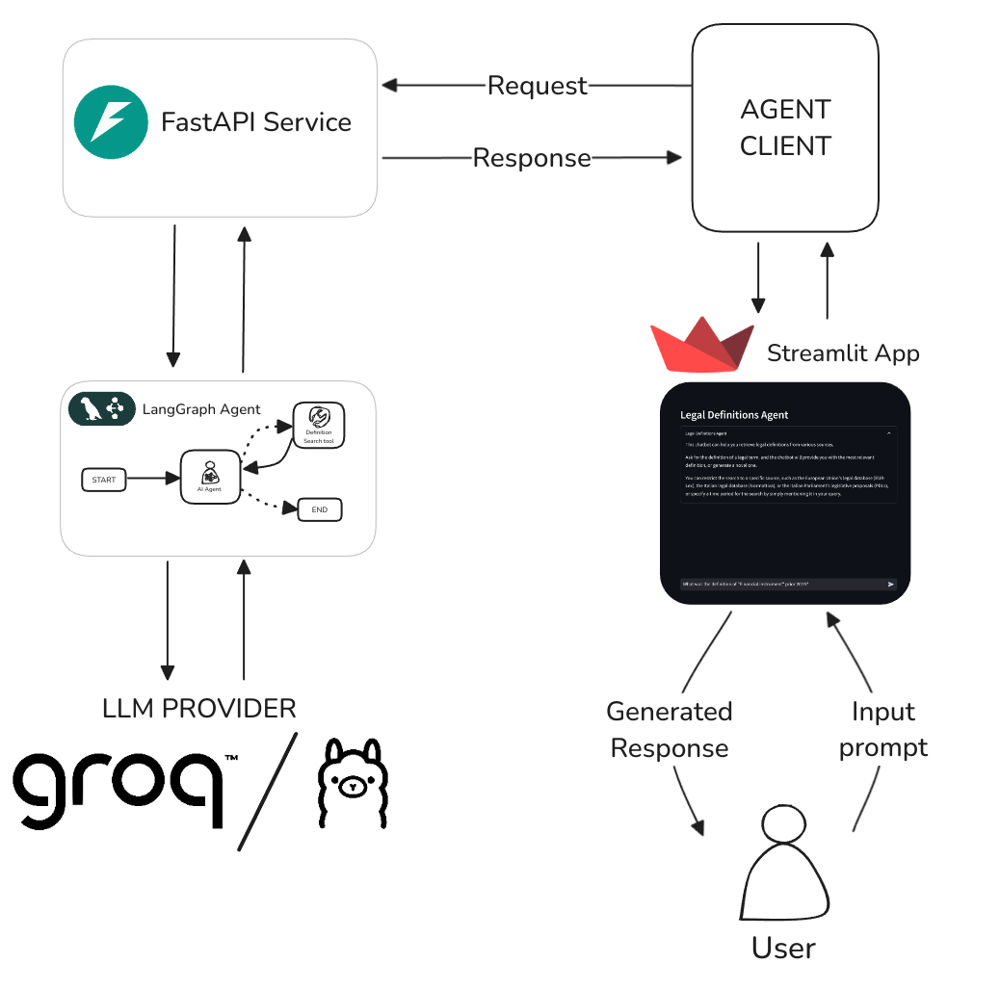
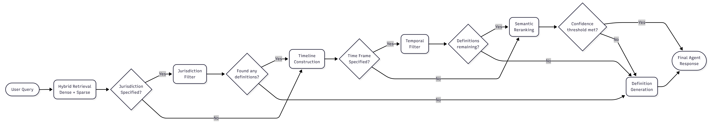

# LegalDefAgent
The complexity, dynamicity over time, and multilingual nature of legislative documents pose significant challenges for the accurate retrieval and reuse of legislative definitions, an essential task in legal drafting.

**LegalDefAgent** an AI-driven system leveraging Large Language Models (LLMs) to assist in the retrieval and generation of legal definitions from a multilingual, multi-jurisdictional dataset of XML-encoded legislative documents.

The system functions as a conversational AI agent, enabling natural language queries tailored to different end-user types, such as lawyers, legislators, and judges.

It employs a hybrid retrieval approach, integrating dense semantic search with sparse keyword-based methods, and incorporates legislation-aware and point-in-time filtering to ensure jurisdictional and temporal accuracy. If no suitable definition is found, the system leverages Retrieval-Augmented Generation (RAG) to generate a novel one that is grounded in and consistent with in-force legislative documents.

The system is evaluated using automatic quantitative metrics and qualitative assessments from legal experts, demonstrating strong retrieval capabilities but highlighting limitations in generating legally sound definitions.

## Installation

   ```sh
   # Clone the repository
   git clone https://github.com/leonardozilli/LegalDefAgent

   # Move to the repository folder
   cd LegalDefAgent

   # Install package and required dependencies using uv
   # uv install options: https://docs.astral.sh/uv/getting-started/installation/
   uv sync

   # Activate the virtual environment
   source .venv/bin/activate
   ```


## Configuration
Copy and rename the environment template `.env-example` to `.env` and populate it with the required credentials.

## Usage
LegalDefAgent provides a CLI for common operations. You can invoke it with:

```sh
legaldefagent [COMMAND] <args>
```

Available commands:

- `extract-definitions` : Extract definitions from local XML files or eXistDB collections.
- `embed-definitions`   : Compute embeddings for extracted definitions.
- `populate-vectorstore`: Populate the vector store with the generated embeddings and metadata.
- `run-service`         : Start the backend agent service.
- `run-app`             : Start the Streamlit frontend app.

Example workflow:

```sh
# Extract and embed definitions
legaldefagent extract-definitions -s exist

legaldefagent embed-definitions -i data/definitions_corpus/definitions.csv

# Populate the vector store
legaldefagent populate-vectorstore -d data/definitions_corpus/definitions.csv -e data/embeddings/defs_embeddings_hybrid.pkl

# Start the FastAPI server
python -m legaldefagent.cli run-service

# In a separate terminal, launch the Streamlit app
python -m legaldefagent.cli run-app
```

## Docker Setup
Alternatively, run the application using Docker:

1. Build base image:
   ```sh
   docker build -t legaldefagent-base:latest -f Dockerfile.base .
   ```

2. Build and start the services:
   ```sh
   docker-compose up --build
   ```
The services will be available at:
   - FastAPI: `http://localhost:8000`
   - Streamlit: `http://localhost:3000`


## Documentation

### Architecture Overview



- **Milvus** stores embeddings of legal definitions.

- **eXist-db** stores XML sources (Akoma Ntoso, EurLex, Normattiva).

- **API** bridges queries between frontend, embeddings, and XML collections.

### Definition Retrieval Pipeline




## License

This project is licensed under the MIT License - see the [LICENSE](LICENSE) file for details.
