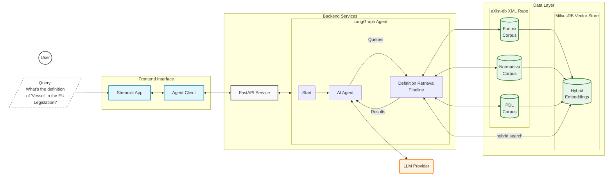
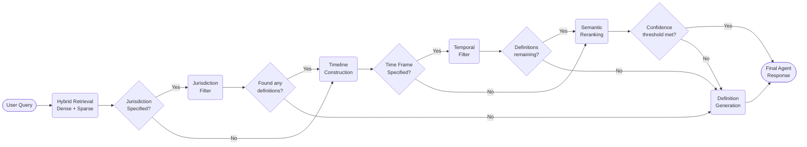

# Legislative Definitions Agent

[](https://www.python.org/downloads/) [](https://www.docker.com/) [](https://opensource.org/licenses/MIT)

An AI-driven system that leverages Large Language Models (LLMs) for extracting, indexing, retrieving and generating legal definitions from XML-encoded legislation across different jurisdictions, languages and time periods. It is designed to assist legal professionals in efficiently accessing and utilizing legislative definitions, keeping in mind the complexities of legal texts and their evolution over time.

The system functions as a conversational agent, enabling natural language queries tailored to different end-user types, such as lawyers, legislators, and judges. It employs a hybrid approach for the retrieval of legal definitions, integrating dense semantic search with sparse keyword-based methods, and incorporates jurisdiction-aware and point-in-time filtering to ensure jurisdictional and temporal accuracy. In cases where an already established definition is not found, the system leverages Retrieval-Augmented Generation (RAG) techniques to generate a novel one that is grounded in and consistent with in-force legislative documents.

The system is evaluated using automatic quantitative metrics and qualitative assessments from legal experts. The findings demonstrate strong retrieval capabilities but highlight limitations in generating definitions that fully comply with legal standards, underscoring the need for human oversight in legal applications of AI.

------

## Architecture



### Definition Retrieval Pipeline




### Components
- **Backend**: A FastAPI service hosting the LangGraph agent.
- **Frontend**: A Streamlit application providing a chat interface for users, capable of visualizing the inputs and outputs of each node within the retrieval pipeline tool for transparent execution tracing.
- **Client module**: Facilitates communication between the frontend and backend services.
- **Data Layer**:
    - **eXist-db**: XML database for hosting and querying Akoma Ntoso legislative documents.
    - **MilvusDB**: Stores vector embeddings for hybrid semantic search.
- **Orchestration**: LangChain and LangGraph manage the agent's reasoning loop and tool execution.


## Installation

#### Local setup:

```bash
git clone https://github.com/leonardozilli/LegalDefAgent
cd LegalDefAgent
uv sync
source .venv/bin/activate
cp .env-example .env
# Edit .env to add API keys and DB credentials
```

## Usage
The system has a CLI for common operations. You can invoke it with:

```sh
legaldefagent [COMMAND] <args>
```

Available commands:

- `extract-definitions` : Extract definitions from local XML files or eXistDB collections.
- `embed-definitions`   : Compute embeddings for extracted definitions.
- `populate-vectorstore`: Populate the vector store with the generated embeddings and metadata.
- `run-service`         : Start the backend agent service.
- `run-app`             : Start the Streamlit frontend app.

Example workflow:

```sh
# 1. Extract definitions
legaldefagent extract-definitions -s exist

# 2. Compute embeddings
legaldefagent embed-definitions -i data/definitions_corpus/definitions.csv

# 3. Populate the vector store
legaldefagent populate-vectorstore -d data/definitions_corpus/definitions.csv -e data/embeddings/defs_embeddings_hybrid.pkl

# 4. Start the FastAPI server
legaldefagent run-service

# 5. Launch the Streamlit app
legaldefagent run-app
```

The services will be available at:
   - Backend: `http://localhost:8000`
   - Frontend: `http://localhost:3000`

### Docker
To run with Docker Compose:

```bash
# 1. Build the base image
docker build -t legaldefagent-base:latest -f docker/Dockerfile.base .

# 2. Start services
docker-compose up --build
```


---

## Project Structure

```text
├── data/                           # Data storage (corpora, embeddings)
├── docker/                         # Dockerfiles and container configurations
├── evaluation/                     # Evaluation utilities and artefacts
├── src/
│   └── legaldefagent/          
│       ├── api/                    # FastAPI service definitions
│       ├── core/                   # Core logic and tool implementations
│       │   ├── agents/             # LangGraph agent definitions
│       │   ├── db/                 # Database interaction modules
│       │   │   ├── existdb/        # XQuery handlers for eXist-db
│       │   │   └── vectorstore/    # MilvusDB integration
│       │   ├── schema/             # Data schemas and models
│       │   ├── tools/              # Agent Retrieval tools
│       │   └── llm.py              # LLM provider integration
│       ├── frontend/               # Streamlit frontend application
│       ├── ingestion/              # Data ingestion modules
│       ├── cli.py                  # CLI entry point
│       ├── settings.py             # Configuration management
│       └── utils.py                # Utility functions
├── pyproject.toml                  # Project dependencies and metadata
├── config.yaml                     # System configuration
└── README.md                       # This file
```
